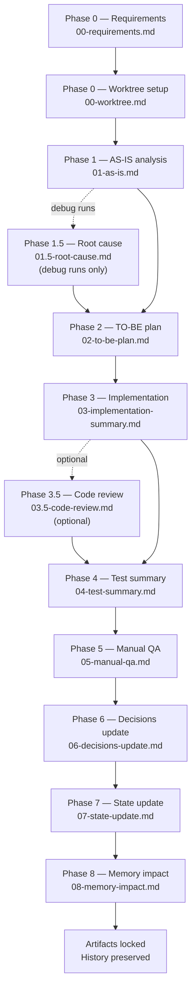

## The problem: context rot

When you work with an AI agent over many sessions, important decisions, requirements, and implementation rationale accumulate in chat history — and then disappear. The agent rediscovers the same facts, makes contradictory choices, and loses track of what was actually agreed. This is context rot.

recursive-mode solves context rot by moving the source of truth out of chat and into repository files. Requirements live in a file. Plans live in a file. Implementation evidence lives in a file. The agent reads those files at the start of every run; it does not rely on remembering what was discussed.

## Prompts are commands, not specs

In recursive-mode, prompts stay short and command-like:

```text
Implement the run
Implement run 75
Start a recursive run
```

The actual requirements, acceptance criteria, and plan live in repo documents. The prompt tells the agent *which phase to run* and *which files to use* — nothing more. This means you can hand off a run to a different agent, resume after a week, or add a contributor without re-explaining everything in chat.

## The run model

Every task is a **run**. Each run gets its own folder:

```text
/.recursive/run/<run-id>/
```

That folder is the durable record for the task. It contains every phase artifact, any addenda, and all evidence. You can read it, audit it, and resume it at any time without depending on chat history.

## Phase progression

A run moves through a fixed sequence of phases. Each phase consumes the previous phase's output as input and produces its own locked artifact before the next phase can begin.



Phases are one-way. Once a phase locks, the agent cannot edit its artifact. If a later phase discovers a gap in an earlier phase, it records an **addendum** — a correction file attached to the current phase — rather than rewriting the locked past.

## Audited phases and gates

Most phases are **audited**. An audited phase must complete a full `draft → audit → repair → re-audit → pass → lock` loop before advancing. No phase can declare itself done by assertion alone.

Every phase output must end with two explicit gates:

- **Coverage Gate** — proves the output addresses everything relevant in the input, including any addenda.
- **Approval Gate** — proves the output is ready to proceed to the next phase.

Neither gate can be set to `PASS` unless the audit has already passed.

## The feedback loop

The real power of the workflow is what happens at closeout. Phases 6, 7, and 8 feed validated outcomes back into the shared control plane:

| Phase | Updates |
|-------|---------|
| Phase 6 | `/.recursive/DECISIONS.md` — the global decision ledger |
| Phase 7 | `/.recursive/STATE.md` — the current state of the codebase |
| Phase 8 | `/.recursive/memory/` — durable domain knowledge, patterns, and lessons |

The next run starts by reading all three. This means each run benefits from the validated conclusions of every previous run — requirements are understood faster, analysis is more accurate, and the agent avoids repeating past mistakes.

## Key guardrails

<Note>
  These guardrails are non-negotiable. They exist to keep the workflow auditable and the history trustworthy.
</Note>

- **Repo documents are the source of truth.** The agent reads phase input files from disk at the start of each phase. Conversational context cannot carry requirements.
- **Phases are one-way.** After a phase locks, its artifact is not edited. Use addenda for corrections.
- **Locked history is not rewritten.** All corrections flow forward through addenda and downstream reconciliation.
- **Gates are mandatory.** Every phase artifact must end with `Coverage: PASS` and `Approval: PASS` — and both require a prior `Audit: PASS`.
- **Delegated work is not trusted without verification.** When subagents contribute, the main agent verifies their claims against real files, diffs, and artifacts before accepting.
